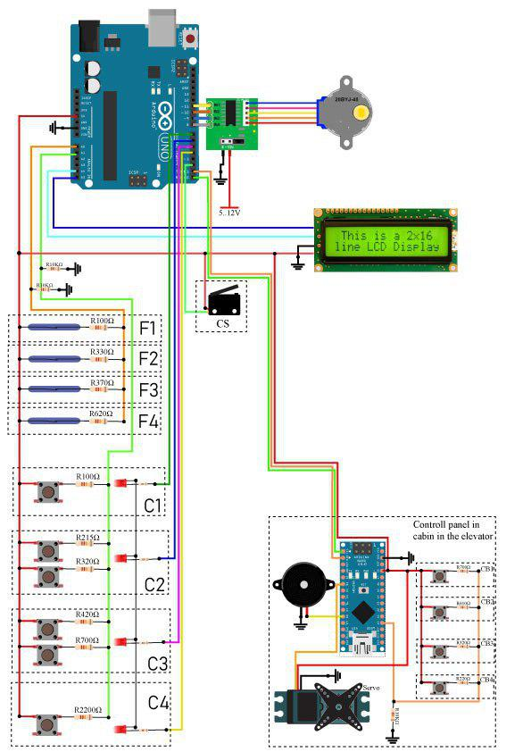

# Elevator
## Intro
The project "Elevator" is constructed on platform Arduino. I builded the elevator the which principle of operation
is the same as the real elevator. The elevator has 4 floors, a cabin and a panel control. 

## Components
 Here are the things I use:
 
    * Arduino uno
    * Arduino nano
    * Reed switch(4x)
    * Button switches(10x)
    * Servomotor
    * Lcd display 16x2 I2C
    * Driver module ULN2003 for step mottor
    * Step motor 28-BYJ48
    * Buzzer
## Schematics    

## Description of schematic:
 * **F**n(n = 1,2,3,4) - That are sensors(Reed switch) which connected on every floor. Each sensor is connected by a resistor and link up with analog input A0 on Arduino Uno. Each sensor when is active has own signal from interval (0;1024).        Level of signal depends on the resisting of resistor.
 
 * **C**n (n = 1,2,3,4) - That are buttons of calling the elevator(Call bar). They are connected by resistors with different                 nominals and link up to analog input A1 on Arduino Uno. The call bar has two buttons(only on 2,3 floors).These               buttons are used to call Elevator, the dependency wherever you want to go (up/down) - It's not implemented at the             moment! Also each floor has one led which light up when this floor is called.
 
 * **CS**(Calibration Switch) is a calibration switch located on the first floor. When the Elevator starts to work, first and foremost, it is calibrating (down to the first floor, while CS is not pressed).
 
 * **CB**n( n = 1,2,3,4) - That is, the Elevator call buttons, which are located in the cabin. They also are connected by resistors with different nominals and link up to analog input A0 on Arduino nano(In the Cabin).
 
 * **Motor** - For this project I use a step motor 28-BYJ48 with connected by driver module ULN2003
 
 * **Display** - I connected the Lcd display 16x2 by module I2C. The display shows the floor at the momentю
 
 * **Servor** - The servo drive is used to open and close the door
 
 * **Buzzer** - It is used to signal that the Elevator has arrived
 
 
